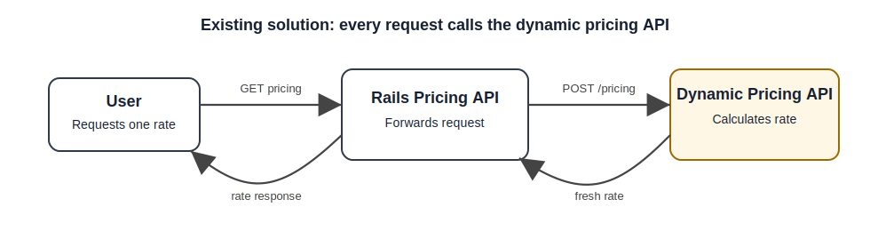
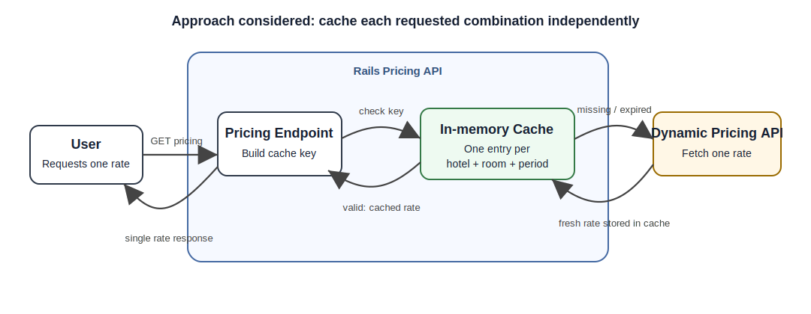
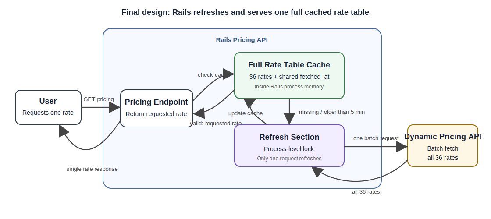

# Dynamic Pricing Proxy

> Diagrams are stored as static SVG files under `docs/images/` so they render correctly on GitHub without relying on Mermaid support.

## Problem Summary

The existing Rails endpoint returns a price for a given `period`, `hotel`, and `room`.

The current implementation is very direct: for every user request, it calls the dynamic pricing model and returns the response. That works functionally, but it does not fit the constraints of this assignment.

The main constraints are:

- The upstream pricing API allows only **1,000 requests per day** using a single API token.
- This service should support at least **10,000 user requests per day**.
- A fetched rate is considered valid for **5 minutes**.

So the main goal is not only to return a price. The service also needs to reuse valid rates and keep calls to the pricing model below the daily limit.

---

## Requirements I Considered

The user-facing API should:

- Accept `period`, `hotel`, and `room` as request parameters.
- Return one rate for the requested combination.
- Return the rate for the exact combination requested by the user.
- Return validation errors when required parameters are missing.
- Return validation errors when unsupported values are provided.
- Return a clear error when a valid rate cannot be provided.

From a system behavior point of view, the service should:

- Handle at least **10,000 user requests per day**.
- Respect the upstream limit of **1,000 requests per day**.
- Never return a rate fetched more than **5 minutes ago**.
- Avoid unnecessary calls to the pricing model.
- Handle upstream failures without silently returning stale data.

---

## Upstream API Constraints

The dynamic pricing API has a few important constraints and capabilities:

- It allows **1,000 requests per day per token**.
- It supports batch pricing, so one request can include multiple `period`, `hotel`, and `room` combinations.
- Supported periods are:
   - `Summer`
   - `Autumn`
   - `Winter`
   - `Spring`
- Supported hotels are:
   - `FloatingPointResort`
   - `GitawayHotel`
   - `RecursionRetreat`
- Supported rooms are:
   - `SingletonRoom`
   - `BooleanTwin`
   - `RestfulKing`

This means there are only 36 valid pricing combinations:

```text
4 periods x 3 hotels x 3 rooms = 36 combinations
```

This small fixed set is important because it makes it practical to fetch and cache the full rate table.

---

## Assumptions

For this assignment, I made the following assumptions:

1. The user-facing API receives one pricing request at a time: one `period`, one `hotel`, and one `room`.
2. The supported `period`, `hotel`, and `room` values are fixed and match the upstream API documentation.
3. A rate is valid for 5 minutes from the time it is fetched from the pricing model.
4. An in-memory cache is acceptable for this assignment because only 36 rates need to be stored.
5. The application is running as a single Rails instance/process.
6. If the application restarts, the in-memory cache is lost. The next request can refresh the full rate table.
7. If the pricing model is unavailable and there is no valid cached rate, the API should return an error instead of returning stale data.
8. The assignment does not define a strict latency SLA, so I focused on keeping the normal cache-hit path fast and simple.

---

## Existing Implementation

The existing implementation calls the dynamic pricing model for every user request.



This is simple, but it can easily exceed the upstream limit.

For example, if this service receives 10,000 user requests in a day, the existing implementation may also make close to 10,000 calls to the pricing model. That is much higher than the allowed 1,000 requests per day.

It also does not use two important facts from the assignment:

1. A fetched rate can be reused for 5 minutes.
2. The upstream API can return multiple rates in a single batch request.

Because of that, the existing implementation is not enough for this assignment.

---

## First Approach Considered: Cache Each Combination Separately

My first idea was to cache each requested combination for 5 minutes.

The cache key would be:

```text
(hotel, room, period)
```

The cache value would be:

```text
{ rate, fetched_at }
```

For every request, the service would check whether a valid cached rate exists for the requested `hotel`, `room`, and `period`.

If the cached rate exists and was fetched within the last 5 minutes, it would be returned. If it is missing or older than 5 minutes, the service would call the pricing model for that single combination and then store the fresh rate.



This is better than calling the pricing model for every request, but it still has a problem.

Each combination can expire and refresh independently. For one combination, there are 288 five-minute windows in a day:

```text
24 hours x 60 minutes = 1,440 minutes/day
1,440 / 5 = 288 five-minute windows/day
```

Since there are 36 valid combinations, independent refreshes can lead to:

```text
36 combinations x 288 refreshes/day = 10,368 upstream requests/day
```

That is still higher than the upstream limit of 1,000 requests per day.

So per-combination caching uses the 5-minute validity rule, but it does not fully solve the quota problem. I did not choose it as the final design.

---

## Final Design: Cache the Full Rate Table

The final design treats all 36 rates as one cached rate table.

When the cache is missing or older than 5 minutes, the service fetches all 36 combinations in one upstream batch request and stores them with a shared `fetched_at` timestamp.

For the next 5 minutes, user requests are served from this cached rate table. The API still returns only the single rate requested by the user.



The cache structure is roughly:

```text
{
  fetched_at: <timestamp>,
  rates: {
    (hotel, room, period) => rate
  }
}
```

This keeps the upstream usage predictable.

```text
1 refresh every 5 minutes = 288 refreshes/day
1 upstream request per refresh = 288 upstream requests/day
288 < 1,000 requests/day limit
```

This is why I chose the batch refresh approach. It directly uses the upstream batch API and stays within the daily request limit.

It also keeps the implementation small. Since there are only 36 rates, an in-memory cache is enough for this assignment under the single-instance assumption.

---

## Concurrency and Failure Handling

One edge case is when the cache expires and many requests arrive at the same time.

Without any protection, multiple requests could all notice that the cache is expired and call the dynamic pricing API together. That would waste upstream quota.

To avoid this, the refresh section is protected with a simple process-level lock.

The flow is:

1. The first request that sees an expired cache enters the refresh section.
2. It fetches all 36 rates in one upstream request.
3. It updates the cache with the new rate table and `fetched_at` timestamp.
4. Other requests wait briefly.
5. After the refresh completes, the waiting requests re-check the cache and use the updated data.

The service should not return a rate older than 5 minutes.

Failure behavior:

- If the cache is still valid and the upstream API is unavailable, the service can return the valid cached rate.
- If the cache is missing or expired and the upstream API fails, the service returns an error instead of returning stale data.
- The upstream call uses a timeout so requests do not hang forever.
- If a refresh attempt fails, a short failure cooldown can be used so waiting requests fail fast instead of retrying the upstream API one by one.
- The cache is only replaced after a successful and valid upstream response.
- A partial or invalid upstream response should not overwrite a previously valid cache.

For this assignment, I treat the 5-minute freshness rule as strict. In a real product, I would confirm with product whether returning slightly stale rates during an upstream outage is acceptable.

---

## Production Notes

This solution is intentionally simple and assumes a single Rails instance with an in-memory cache.

That keeps the implementation focused on the core assignment problem: using the 5-minute validity window and the upstream batch API to stay below the 1,000 requests/day limit.

If this were deployed with multiple Rails instances, I would move the full rate table and `fetched_at` timestamp to a shared cache such as Redis. That would prevent each instance from refreshing the cache independently.

I would also add metrics and structured logs for:

- Cache hits and misses
- Cache refresh start/success/failure
- Upstream request count
- Refresh latency
- Cache age
- Upstream errors

I avoided adding Redis, a scheduler, or distributed locking to the assignment implementation because those add extra infrastructure. Under the assumptions above, the current design is enough to satisfy the assignment constraints.

---

## Requirements

To run this project locally, make sure the following are available:

- Docker
- Docker CLI
- Internet access to pull the upstream Rate API image
- `curl` installed locally
- Ports `3000` and `8080` available

The application uses two Docker containers:

- `rate-api` - the upstream dynamic pricing API
- `pricing-api` - this Rails pricing proxy application

The helper script `run.sh` starts both services.

---

## Running the Service

Make sure the script is executable:

```bash
chmod +x run.sh
```

Start both services:

```bash
./run.sh
```

or explicitly:

```bash
./run.sh start
```

The script will:

1. Create a Docker network if needed.
2. Pull the upstream Rate API image:

```bash
docker pull tripladev/rate-api:latest
```

3. Start the Rate API container on port `8080`.
4. Build the Rails Pricing API Docker image.
5. Start the Rails Pricing API container on port `3000`.
6. Configure the Rails app to call the Rate API using:

```text
RATE_API_URL=http://rate-api:8080
```

After the script finishes, both services should be available:

```text
Rate API:    http://localhost:8080
Pricing API: http://localhost:3000
```

Test the pricing endpoint:

```bash
curl 'http://localhost:3000/api/v1/pricing?period=Summer&hotel=FloatingPointResort&room=SingletonRoom'
```

Example response:

```json
{
  "rate": "12000"
}
```

The exact rate value may vary depending on the upstream pricing API response.

---

## Running Tests

Run the test suite with:

```bash
./run.sh test
```

The test command runs the Rails tests inside Docker.
If the Rate API container is not already running, the script starts it first.

---